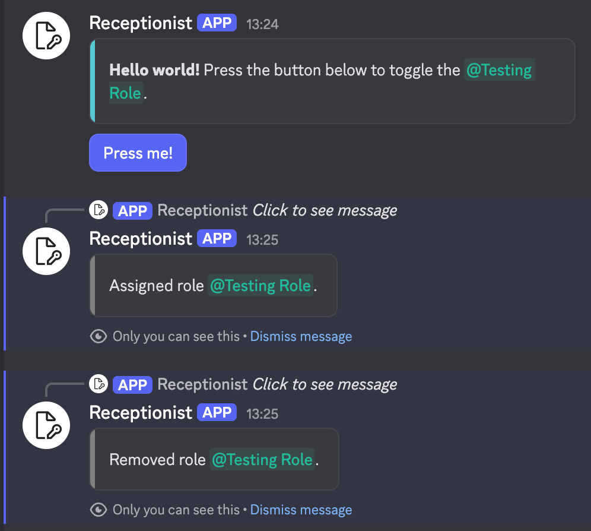

# Receptionist (v1.0.x Archive)
A simple Discord bot for self-role-assigning.  
Archive branch for the v1 revision bot.

### Details
v1.0.x operated using the following process:  
1. Each button was assigned a UUID custom ID when posted to Discord.
2. The corresponding button actions (role to assign, action to take such as assign/remove/toggle, etc.) were stored in a SQLite database along with the location of the button (guild ID, channel ID, message ID).
3. Upon receiving a button press event, the button's UUID was pulled from the event and queried for in the database.
4. The corresponding row was fetched from the database, and its source (guild ID/channel ID) was cross-checked against the interaction event to confirm a match (to avoid spoofing/exploits/data leaks due to bugs).
5. The role to assign and actions to take were parsed from the database row, resolved to the in-Discord roles/objects, and then executed in the corresponding guild.
  
This process while straightforward in concept had major drawbacks:  
- There was significant latency in resolving the IDs stored in the database back to the real-world guild/channel/role objects for operating upon, along with the latency of the query itself.
- The above also added significant complexity to the functioning of the bot.
- The database and Discord-side messages could de-sync due to button messages being deleted, roles/guilds/channels being removed, bot-side crashes leaving the message sent but database-side uncommitted (due to needing to send the message first to obtain its ID for storing in the DB), etc.
- A prune command was added to lookup all entries in the database, verify that their bound messages still exist, and remove any orphaned entries; however, this process took extremely long (roughly 1 second per button) due to needing to fetch the message from the channel from the guild to confirm their existence.

As such, v1.1.x shifted to a different process:
- Each button's action details and role to assign are encoded into the button's custom ID itself, removing the need for a separate database.
- On receiving a button press event, the custom ID of the button is parsed back into the intended button actions and executed, significantly reducing latency.
- This removes de-syncing of two datasets with the buttons themselves being the single source of truth - the functionality of the button solely relies on the existence of the button (i.e. its message not being deleted) and the referenced role existing.

This SQLite-based v1.0.x variant is archived mainly as a proof-of-concept of a database-based implementation.

---

  
  

### Features
- Role-Assigning Buttons
  - Create messages with role-assigning buttons using simple commands
  - Up to 20 buttons per message
  - Assign, remove, or toggle roles on button press
- General
  - Self-hosted - no public instances provided, host your own via Docker/Podman
  - All data is stored in a config JSON file + SQLite database file, making backups and migrations straightforward
  - No paywalls, premium feature gatekeeping, or other limitations beyond the Discord API and your server specs
  - No excess features or overcomplexity - focuses on role assignment and nothing else

### Use cases
- Provide easily self-assignable cosmetic/functional roles
- Create a verification process to prevent unauthorized/bot access to certain channels/servers

--- 
 
### Docs/Commands/How-to
- [Installation and Setup](./docs/Setup.md)
- [Button Message Editor](./docs/ButtonMessageEditor.md)
- [Administration](./docs/Administration.md)

---

## Planned/Todo
- Role assign dropdown menus

