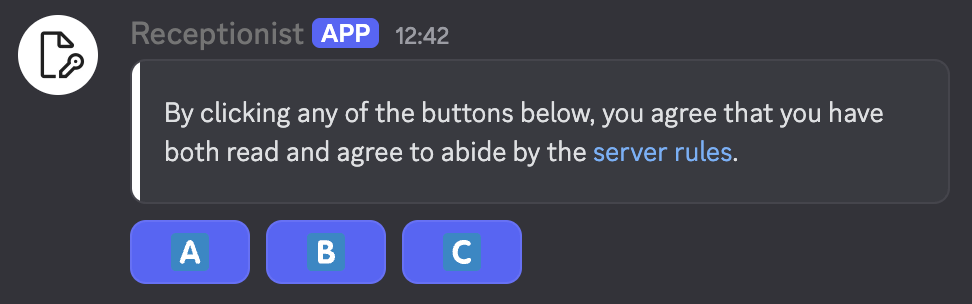

# Button Message Editor 

This module/set of commands allows for creating and deploying messages with role-assigning buttons attached below.



### Commands 
- `/buttoneditor setbody` - Sets the body text of the button message currently being created.
  - Option `text` - The text which will be sent in the message. Supports Markdown.
- `/buttoneditor setcontainercolor` - Enables an embed-like container border around the body text of the message being created.
  - Option `color` - The hex color used for the container leftside border. Supply to enable the container; send the command without this option to disable the container.
- `/buttoneditor addbutton` - Adds a role-assigning button to the message being created.
  - Option `action` - The action to perform.
    - Choice `Assign` - Adds the specified role to the user on press.
    - Choice `Remove` - Removes the specified role from the user on press.
    - Choice `Toggle` - Adds the specified role if the user doesn't have it; removes the role if they do.
  - Option `role` - The role to assign/remove/toggle from the user pressing the button.
  - Option `label` - The text label for the button.
  - Option `emote` - The emote label for the button.
    - Provide at least one of `label` or `emote`. Both works as well.
  - Option `silent` - Whether or not to skip notifying the user after a role assign/removal/toggle takes place.
    - If left false (the default if not specified), the user will be given a small confirmation message after clicking the button which only they can see.
- `/buttoneditor removebutton` - Removes a role-assigning button from the message being created.
  - Option `id` - The numeric ID of the button to remove (obtain from below command).
- `/buttoneditor status` - Shows the details and entered data for the message being created.
- `/buttoneditor deploy` - Deploys the assembled message to the channel in which this command is sent.
- `/buttoneditor clear` - Resets message builder data currently stored in the editor.


### Simple example usage
```
/buttoneditor setbody text:**Hello world!**\n\nPress the button below to toggle the special Testing role!
/buttoneditor setcontainercolor color:5dcbde
/buttoneditor addbutton action:Toggle role:@Testing label:Toggle testing role silent:false
/buttoneditor status 
/buttoneditor deploy
```
The above would create a message with a button which would toggle the `@Testing` role on press.

### Tips
- Discord mobile allows for entering multiline text into text options of slash commands.
  Use this to enter multi-line body text when using `/buttoneditor setbody`.